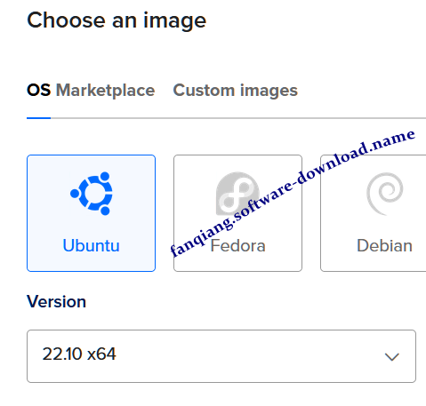
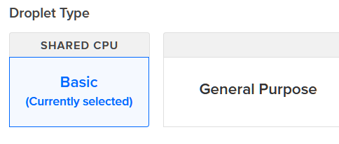
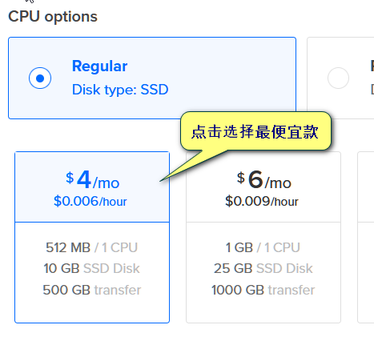
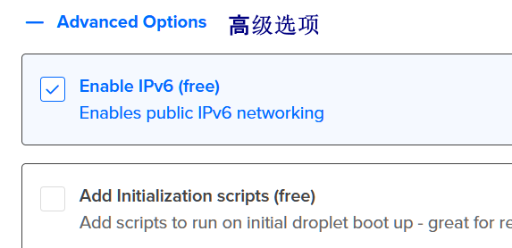

零起点DO VPS shadowsocks-libev 翻墙设置教程
===

[Digital Ocean](https://m.do.co/c/89497bd485e0) (DO) 的优点：
---

- 业界最有名的VPS服务商，服务有保障
- 全SSD硬盘，速度极快，重启在10秒内
- 所有 VPS 具有独立 IP 地址
- 费用极低，$4/月起，作为 shadowsocks 足够了
- DO 网站的管理面板 Console 可以直接运行所有 Linux 命令，可以不在本机设置 SSH
- 收费以小时计算，不用了可以删除，不会多收一分钱
- 官方专业人员发布大量零起点教程，服务器管理菜鸟的福音
- [更换 IP 十分方便](03.9-1.md)，创建 snapshot，再从 snapshot 新建 Droplet, 就能得到新的 IP了

    [Digital Ocean](https://m.do.co/c/89497bd485e0) 更换 IP 就是几分钟的事情，然后翻墙客户端更新一下 Server IP 就可以了

**[立即点击这里注册DO](https://m.do.co/c/89497bd485e0)**

创建翻墙用的虚拟服务器 Droplet
--------

为什么 [Digital Ocean](https://m.do.co/c/89497bd485e0) 把 VPS 叫作 Droplet (水滴) 呢？ 这是因为公司名字是 Digital Ocean（数字海洋），正是海量的水滴组成了 VPS 的海洋

现在我们知道了 VPS 在 DO 叫作 Droplet

注册DO并绑定支付方式后，登录 [Digital Ocean](https://m.do.co/c/89497bd485e0) 管理后台，点击右上角的 `Create` 从下拉菜单中选择 `Droplets`:

- Choose region 选择地区

    多个城市可选，一般选择 San Francisco 或 New York。据从国内有限 ping ip 测试，San Francisco 比 New York 快约 60ms
    

- Datacenter 选择数据中心

    同一个地区可能有多个数据中心，不同数据中心的附加功能可能有所不同，页面有提示。对于翻墙来说，此步使用默认值就可以了

- Choose an image 选择操作系统镜像

    默认就是最新版的 Ubuntu x64，挺好!
    

- Choose Size 选择大小

    1. Droplet type 选择类型

        

        如上图，选择 `Basic` 基础款 VPS

    2. CPU options 配置选项

        

        如上图，点击左侧的箭头后，会显示出我们需要的最便宜的方案

        

        如上图，再点击选择最便宜的VPS方案，4 美元每月，0.006美元每小时，相当于人民币几分钱每小时

- Advanced options 高级选项

    

    `Advanced Options` （高级选项）可能默认没有展开，点击展开它

    勾选 `Enable Ipv6(free)`(启用 IPv6)

- Finalize Details 最终细节设置

    

    - Quantity（数量）。默认创建 1 个 Droplet
    - Hostname（主机名）。你自己用来分辨主机的特点、用途等
    - Tags（标签）。如果你的VPS很多，标签可以用来分类。此处可以不填

- Create Droplet 创建虚拟服务器 VPS

    

    点击 **Create Droplet** 创建虚拟服务器VPS

进入 [Digital Ocean](https://m.do.co/c/89497bd485e0) VPS管理界面
---

在20秒内，VPS创建完毕后自动进入了 `Droplets` （VPS）列表页面

如上图，以后每次登录 [Digital Ocean](https://m.do.co/c/89497bd485e0) 网站后，先展开左侧导航栏的 `MANAGE` (管理)，点击 **Droplets** 进入所有 VPS 的管理页面，再点击某个 Droplet 名字进入某个VPS的管理页面

如何重置DO VPS Root密码
---

注：如果已经通过邮件收到root密码，请跳到一下步

在进入你的某个 VPS 管理页面后，

点击左边的 `Access` 再点击右边的 `Reset Root Password` 重置密码：

重置密码完成后，新的密码会发送到你的邮箱，下面我们就用这个密码登录并直接通过网页 Console 控制台管理 VPS

进入DO VPS命令行控制界面 Console Access
---

DO有个极为强大的功能，可以可以直接在管理后台 Access Console  运行 Linux 命令管理 VPS，相当于一个在线版的ssh

如上图，在进入你的 Droplets 列表页面后，点击某个Droplet最右边的 **More**, 在弹菜单中选择 **Access Console** 进入命令行管理VPS

打开 Console 的另一方法是，进入某个VPS的管理页面后，点击页面右上角的 `Console`

或者先点击左边的 `Access` 然后点击 `Launch Droplet Console` 如下图：

如果你等了一会儿命令行界面还没有出来，就按F5刷新页面直到打开

点击打开的命令行窗口以获得输入焦点

命令行设置新的Root密码
---

开启 [Digital Ocean](https://m.do.co/c/89497bd485e0) Console Access后，输入root并回车，然后重新设置密码

    Ubuntu 18.04 ubuntu-shadowsocks tty1
    ubuntu-shadowsocks login: root
    Passwd: 输入root密码
    You are required to change your password immediately (root enforced)
    Changing password for root.
    (Current) UNIX password: 输入root密码
    Enter new UNIX password: 输入新的root密码
    Retype UNIX password: 再次输入新的root密码

密码更新完成后更新一下系统：

    root@ubuntu-shadowsocks:~# apt-get update
    root@ubuntu-shadowsocks:~# apt-get dist-upgrade

可能会问你要不要更新一下grub，直接回车就行了。（我选择的是升级到 `install the package maintainer's version`）

附录一：[快速、极省钱更换 DO VPS IP 地址](03.9-1.md)
---

附录二：怎样不“登录”路由器更改OpenWrt shadowsocks-libev路由器的server IP
---

- 路由器设置密钥登录，这样ssh登录就不用密码了
- 创建config配置文件, Ubuntu下是 `~/.ssh/config`，增加如下内容：

        Host router
            HostName 192.168.1.1
            User root
            Port 22
            IdentityFile /path/to/your/rsa

    Windows下安装 [git for Windows](https://git-scm.com/download/win)，选择使用OpenSSH，编辑 `C:\Program Files\Git\etc\ssh\ssh_config`

    然后同 Ubuntu 下一样可以用 `ssh router` 登录路由器，再也不用手动输入密码登录路由器了

- resetip.sh:

        #!/bin/bash

        # Author: https://github.com/softwaredownload/openwrt-fanqiang
        # Date: 2016-01-20

        ssh router <<'ENDSSH'

        sed -ri "s/([0-9]{1,3}\.){3}[0-9]{1,3} -j/1.0.9.8 -j/" /usr/bin/ss-firewall-asia
        sed -ri "s/([0-9]{1,3}\.){3}[0-9]{1,3}/1.0.9.8/" /etc/shadowsocks-libev/config.json

        /etc/init.d/shadowsocks restart

        ENDSSH

    把resetip.sh中的 `1.0.9.8` 改成shadowsocks服务端的server IP，然后运行 resetip.sh就可以了

    Windows下安装 [git for Windows](https://git-scm.com/download/win) 后，用资源管理器打开 resetip.sh 所在目录，右键，选择 **Git Bash Here**, 然后 **./resetip.sh** 就可以执行 bash 脚本了

    想要测试一下日本，英国，新加坡或美国的IP，so easy，5分钟就行了

附录三：江湖求急，用[DO](https://m.do.co/c/89497bd485e0) Console 控制台从源码编译 shadowsocks-libev server
-------------------

2016-01-19发现，shadowsocks.org 网页无法打开，这给 `apt-get install` 方式安装shadowsocks-libev带来不便，不过我们可以自己从源码编译，很简单，而且随时可以编译到最新的版本

Console Access 界面是无法粘贴命令的，把下面命令逐行粘贴到浏览器地址栏，抄着输入也是很快的，输入第一行命令并回车后输入 y 安装所有相关包

    root@ubuntu-shadowsocks:~# apt-get install build-essential autoconf libtool libssl-dev gawk debhelper dh-systemd init-system-helpers pkg-config git
    root@ubuntu-shadowsocks:~# git clone https://github.com/shadowsocks/shadowsocks-libev.git
    root@ubuntu-shadowsocks:~# cd shadowsocks-libev
    root@ubuntu-shadowsocks:~# dpkg-buildpackage -us -uc -i
    root@ubuntu-shadowsocks:~# cd ..
    root@ubuntu-shadowsocks:~# sudo dpkg -i shadowsocks-libev*.deb
    root@ubuntu-shadowsocks:~# ls /usr/bin/ss-*
    root@ubuntu-shadowsocks:~# ss-local ss-manager ss-redir ss-server ss-tunnel

设置 shadowsocks-libev server，见 [翻墙软件Shadowsocks-libev服务端设置](03.2.md)

至此，我们已经开通了DO VPS,并且在网页界面就安装完成了 shadowsocks-libev，下面是修改设置并重启shadowsocks-libev

    root@ubuntu-shadowsocks:~# vi /etc/shadowsocks-libev/config.json
    root@ubuntu-shadowsocks:~# service shadowsocks-libev restart

详细的设置教程在 [翻墙软件Shadowsocks-libev服务端设置](03.2.md)

再配置好客户端，如果没有错误，就可以成功翻墙了。所有以上过程2016-01-19亲测通过

一般情况下我们应该从仓库安装预编译shadowsocks-libev包：

    sudo apt update
    sudo apt install shadowsocks-libev

从仓库安装以后，以后你 更新 Ubuntu 时，shadowsocks 也会得到更新(如果有新版)。如果你是从源码编译安装的 shadowsocks，难道弄个定时器提醒自己十天半月从源码编译更新一次？岂不烦人

这里从源码编译 shadowsocks-libev 只是演示 [DO](https://m.do.co/c/89497bd485e0) Console 控制台的强大之处。万一服务器 IP 被封，或者其他原因登录不上 SSH，我们可以用 DO Console 管理 VPS，Console 就是在线版的 SSH

VPS价格更便宜的也许会有，但是服务稳定性，技术积累，各种资源，小型 VPS 提供商是不能和 DO 这样业界领先的 VPS 提供商相比的

**相关资源**：

- [Ubuntu OpenWrt 开启 TCP Fast Open](./06.01.md)
- [Shadowsocks 服务端 Ubuntu 开启BBR加速](./06.1.md)
- [Ubuntu server 最大打开文件数目优化](./06.2.md)
- [Linux TCP UDP 网络性能优化](./06.3.md)
- [Linux Ubuntu swap 交换文件优化](./06.4.md)
- <https://github.com/shadowsocks/shadowsocks-libev>
- <https://fanqiang.software-download.name/>